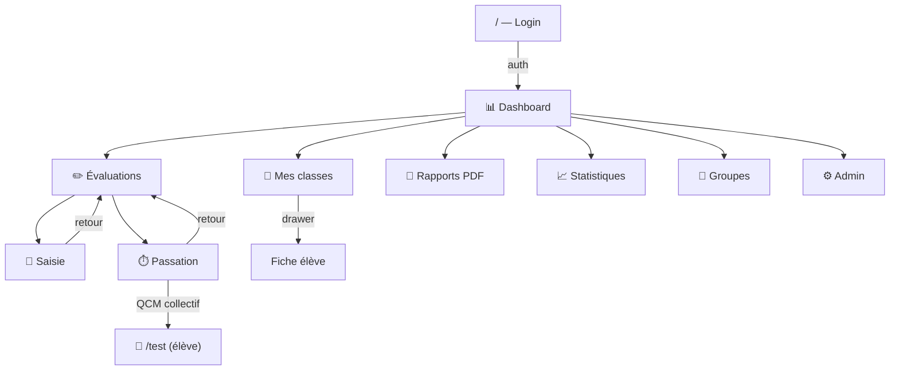
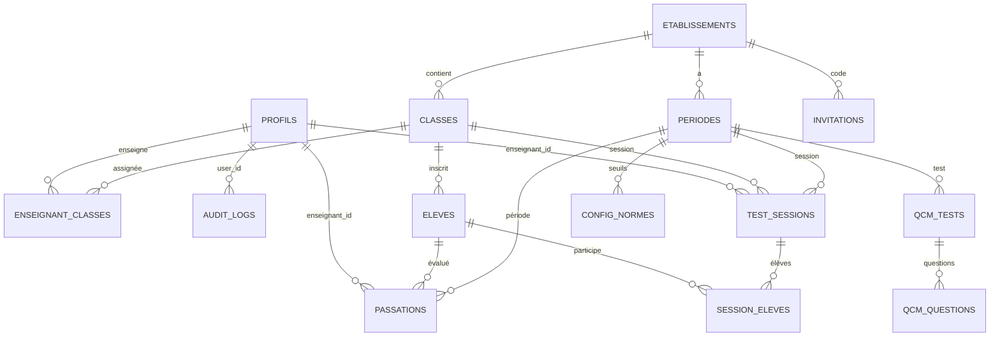

# Architecture FluenceApp

> Plateforme de tests de fluence et compréhension — Académie de Guyane
> Dernière mise à jour : 2026-04-02

---

## 1. Arborescence annotée

```
fluence-app-main/
├── app/
│   ├── page.tsx                         # Login / Inscription / Reset password
│   ├── layout.tsx                       # Root layout (notifications, onboarding)
│   ├── test/page.tsx                    # Interface QCM élève (publique, code individuel)
│   ├── legal/page.tsx                   # Mentions légales
│   ├── api/health/route.ts              # Health check endpoint
│   │
│   ├── dashboard/
│   │   ├── page.tsx                     # Tableau de bord (vue rôle-dépendante)
│   │   ├── evaluations/page.tsx         # Hub évaluations (2 cartes : saisir / tester)
│   │   ├── saisie/page.tsx              # Saisie manuelle des scores (post-test)
│   │   ├── passation/page.tsx           # Passation live (chrono 60s + QCM collectif)
│   │   ├── mes-classes/page.tsx         # Vue classes enseignant (cartes + élèves + groupes)
│   │   ├── mes-eleves/page.tsx          # Tableau élèves enseignant (legacy, remplacé par mes-classes)
│   │   ├── eleves/page.tsx              # Explorateur élèves (admin/direction/réseau)
│   │   ├── eleves/[id]/page.tsx         # Fiche classe détaillée
│   │   ├── eleve/[id]/page.tsx          # Fiche élève avec graphe progression
│   │   ├── statistiques/page.tsx        # Stats par classe/niveau/réseau
│   │   ├── groupes/page.tsx             # Groupes de besoin (4 niveaux)
│   │   ├── rapport/page.tsx             # Générateur rapports PDF
│   │   ├── rapport/RapportPDF.tsx       # Composants PDF (@react-pdf)
│   │   ├── import/page.tsx              # Import CSV élèves
│   │   ├── profil/page.tsx              # Profil utilisateur + assignation classes
│   │   ├── sessions/page.tsx            # Gestion sessions QCM
│   │   ├── onboarding/page.tsx          # Configuration initiale (direction)
│   │   └── admin/page.tsx               # Panel admin (9 onglets)
│   │
│   ├── lib/
│   │   ├── supabase.ts                  # Client Supabase (anon key, SSR)
│   │   ├── types.ts                     # Types partagés (Classe, Periode, Norme, etc.)
│   │   ├── useProfil.ts                 # Hook : profil + impersonation
│   │   ├── useImpersonation.ts          # Store Zustand : simulation de rôle
│   │   ├── fluenceUtils.ts              # classerEleve(), calculerScore(), periodeVerrouillee()
│   │   ├── auditLog.ts                  # logAction() → table audit_logs
│   │   ├── offlineStorage.ts            # Passations hors-ligne (localStorage)
│   │   ├── useBeep.ts                   # Web Audio API (chronomètre)
│   │   ├── useRealtimeNotifications.ts  # Supabase Realtime (nouvelles passations)
│   │   └── useAnneesScolaires.ts        # Hook : années scolaires disponibles
│   │
│   └── components/
│       ├── Sidebar.tsx                  # Navigation + recherche élève
│       └── ImpersonationBar.tsx         # Barre simulation rôle (admin)
│
├── middleware.ts                        # Protection /dashboard/* (cookie auth)
├── next.config.ts                       # CSP, headers sécurité, performance
└── package.json                         # Dépendances
```

---

## 2. Carte des pages et routes

| URL | Rôles | Fonction | Tables lues | Tables écrites |
|-----|-------|----------|-------------|----------------|
| `/` | Public | Login / Inscription | invitations, profils | profils |
| `/test` | Public (code) | QCM élève en direct | test_sessions, session_eleves, qcm_tests, qcm_questions | session_eleves (via RPC) |
| `/dashboard` | Tous auth | Tableau de bord | profils, passations, classes, periodes, config_normes | — |
| `/dashboard/evaluations` | enseignant+ | Hub saisie/passation | periodes | — |
| `/dashboard/saisie` | enseignant+ | Saisie résultats post-test | classes, eleves, passations, periodes | passations |
| `/dashboard/passation` | enseignant+ | Test live chrono 60s + QCM | classes, eleves, passations, test_sessions | passations, test_sessions, session_eleves |
| `/dashboard/mes-classes` | enseignant | Classes → Élèves → Fiche | enseignant_classes, classes, eleves, passations, config_normes | — |
| `/dashboard/statistiques` | direction+ | Stats classe/niveau/réseau | periodes, classes, eleves, passations, config_normes | — |
| `/dashboard/groupes` | direction+ | Groupes de besoin | periodes, classes, eleves, passations, config_normes | — |
| `/dashboard/rapport` | enseignant+ | Rapports PDF | classes, eleves, passations, config_normes | — |
| `/dashboard/import` | direction+ | Import CSV élèves | classes, eleves | eleves |
| `/dashboard/admin` | admin, réseau | Panel administration | Toutes | Toutes |

---

## 3. Graphe de navigation



---

## 4. Schéma de la base de données



### Tables principales

| Table | Colonnes clés | Rôle |
|-------|--------------|------|
| **profils** | id, nom, prenom, role, etablissement_id | Utilisateurs (8 rôles) |
| **etablissements** | id, nom, type, ville, circonscription | Écoles et collèges |
| **classes** | id, nom, niveau, etablissement_id | Groupes d'élèves |
| **eleves** | id, nom, prenom, classe_id, actif, numero_ine | Mineurs scolarisés |
| **periodes** | id, code, label, annee_scolaire, etablissement_id, actif | T1/T2/T3 par année |
| **passations** | eleve_id, periode_id, score, non_evalue, absent, q1-q6, mode | Résultats fluence + QCM |
| **enseignant_classes** | enseignant_id, classe_id | Assignation prof → classe |
| **config_normes** | niveau, periode_id, seuil_min, seuil_attendu | Seuils par niveau |
| **qcm_tests** | id, periode_id, niveau, titre, texte_reference | Définitions QCM |
| **qcm_questions** | qcm_test_id, numero, question_text, option_a-d, reponse_correcte | Questions QCM |
| **test_sessions** | id, code, classe_id, periode_id, enseignant_id, active, duree_timer | Sessions QCM collectif |
| **session_eleves** | session_id, eleve_id, code_individuel, connecte, termine, reponses_live, timer_reset_at | Suivi élève en temps réel |
| **invitations** | id, code, etablissement_id, role, actif | Codes d'activation |
| **audit_logs** | user_id, action, details, created_at | Journal d'audit |

---

## 5. Rôles et accès

| Rôle | Dashboard | Mes classes | Évaluations | Stats | Groupes | Rapports | Admin | Import |
|------|-----------|-------------|-------------|-------|---------|----------|-------|--------|
| **enseignant** | Vue classe | Oui | Oui | — | — | classe+élève | — | — |
| **directeur** | Vue étab | — | Oui | Oui | Oui | Tous | — | Oui |
| **principal** | Vue étab | — | Oui | Oui | Oui | Tous | — | Oui |
| **coordo_rep** | Vue réseau | — | Oui | Oui | Oui | Tous | Partiel | Oui |
| **ien** | Vue réseau | — | Oui | Oui | Oui | Tous | Partiel | Oui |
| **ia_dasen** | Vue globale | — | — | Oui | Oui | Tous | Complet | — |
| **recteur** | Vue globale | — | — | Oui | Oui | Tous | Complet | — |
| **admin** | Vue admin | — | Oui | Oui | Oui | Tous | Complet | — |

---

## 6. Composants partagés

| Composant | Rôle | Pages | Side effects |
|-----------|------|-------|-------------|
| **Sidebar** | Navigation + recherche élève | Toutes /dashboard/* | Requête Supabase (recherche) |
| **ImpersonationBar** | Simulation rôle (admin) | Toutes /dashboard/* | localStorage, audit_logs |
| **useProfil** | Profil + impersonation | Toutes les pages auth | Supabase Auth + profils |
| **useImpersonation** | Store Zustand impersonation | useProfil, ImpersonationBar | localStorage |

---

## 7. Flux d'authentification

```
Utilisateur → / (Login)
  ├─ signInWithPassword() → cookie sb-*-auth-token
  └─ signUp() + INSERT profils → cookie

middleware.ts vérifie le cookie → /dashboard/*

useProfil() sur chaque page :
  ├─ getSession() → session.user.id
  ├─ SELECT profils WHERE id = user.id
  ├─ Si admin + impersonation active → profil simulé
  └─ Return { profil, profilReel, roleReel }

Logout → signOut() → redirect /
```

---

## 8. Dépendances externes

| Service | Usage | Critique |
|---------|-------|----------|
| **Supabase PostgreSQL** | Base de données | Oui |
| **Supabase Auth** | Authentification JWT | Oui |
| **Supabase Realtime** | Notifications temps réel | Non |
| **Vercel** | Hébergement | Oui |
| **Google Fonts** | Typographie (Geist) | Non |
| **Web Audio API** | Sons chronomètre | Non |
| **@react-pdf/renderer** | Génération PDF | Oui |

---

## 9. RPC Supabase

| Fonction | Paramètres | Usage |
|----------|-----------|-------|
| `get_admin_dashboard` | p_annee | Dashboard admin — KPIs globaux |
| `get_stats_reseau` | p_annee, p_code, p_etab_ids | Stats réseau (IEN/coordo) |
| `get_groupes_overview` | p_annee, p_etab_ids | Groupes de besoin agrégés |
| `submit_qcm_individual` | p_code, p_answers | Soumission QCM élève |
| `check_test_rate_limit` | p_ip_hash | Rate limiting /test |
| `delete_my_account` | — | Suppression compte RGPD |

---

## 10. Points d'attention

### Critique
- **Offline sync** : passations stockées en localStorage non chiffré sur machine partagée
- **Session QCM** : timeout côté client seulement, pas de heartbeat serveur

### Élevé
- **Pages orphelines** : `/dashboard/mes-eleves` et `/dashboard/sessions` ne sont plus dans la sidebar enseignant mais restent accessibles par URL
- **Doublon élève** : `/dashboard/eleves/[id]` et `/dashboard/eleve/[id]` coexistent avec des fonctionnalités proches

### Moyen
- **Config normes** : fallback hardcodé si la table est vide — risque de divergence
- **Onboarding** : page existe mais n'est pas utilisée dans le parcours enseignant

### Info
- **Pas de tests E2E** : seuls des tests unitaires Jest existent
- **Pas de CI/CD** configuré pour les tests de sécurité
